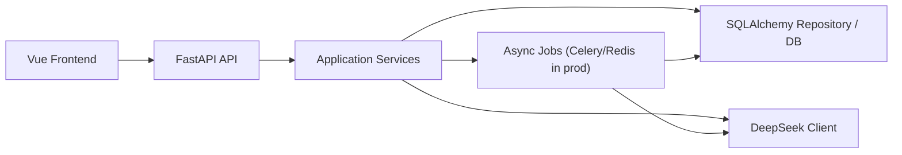

# LingMate 后端详细技术设计文档

## 1. 目标

LingMate 当前前端已经具备完整的学习流转界面：

- 首页导入材料
- 分析页轮询处理状态
- 工作台八模块学习
- 报告页查看学习结果

当前后端仅为内存 mock，不具备真实持久化、异步分析、AI 调用和学习记录能力。本设计文档的目标是将项目升级为可持续演进的正式后端，优先支持单用户、单课完整跑通。

## 2. 范围

### V1 必须支持

- 导入链接并创建 lesson
- lesson 持久化
- analysis 状态轮询
- 八模块课程内容结构化返回
- 学习工作台状态持久化
- 模块完成和操作记录
- 课程报告返回
- DeepSeek 接入位与服务抽象

### V1 暂不实现

- 登录鉴权
- 多租户
- 推荐内容库
- 真正的音频下载和转写执行器
- 真正的 spaced repetition 调度器
- 语音评分

## 3. 总体架构



### 架构分层

- `api`
  - 路由、请求校验、响应格式
- `services`
  - lesson 创建、分析状态计算、学习进度更新、报告生成
- `models`
  - SQLAlchemy 数据模型
- `schemas`
  - Pydantic 请求与响应模型
- `integrations`
  - DeepSeek、转写服务、对象存储等外部系统封装

## 4. 技术选型

### 开发期

- Web 框架：FastAPI
- ORM：SQLAlchemy 2.0
- 配置：Pydantic Settings
- 数据库：SQLite 默认，兼容 PostgreSQL
- 迁移：Alembic
- HTTP 客户端：httpx

### 生产期建议

- 数据库：PostgreSQL
- 异步队列：Celery + Redis
- 文件存储：OSS / S3
- 音频处理：FFmpeg
- 转写：Whisper API 或独立 ASR 服务
- 监控：Sentry + Prometheus

## 5. 核心业务对象

### 5.1 Lesson

一节精听课的主实体，贯穿导入、分析、学习、报告全流程。

主要字段：

- `id`
- `lesson_id`
- `status`
  - `processing`
  - `analysis_ready`
  - `started`
  - `completed`
  - `failed`
- `source_type`
- `source_url`
- `provider`
- `title`
- `analysis_json`
- `module_content_json`
- `report_json`
- `progress_json`
- `created_at`
- `updated_at`

### 5.2 Material

V1 可先不单独拆表，先并入 `lessons`。后续支持推荐库和多 lesson 复用后再拆成独立 `materials` 表。

### 5.3 Submission / Feedback

V1 先预留接口和数据结构，后续用于记录：

- 用户造句
- 场景输入
- 输出练习内容
- AI 点评

## 6. 数据模型设计

### 6.1 lessons

用途：保存课程主状态与聚合内容。

关键字段：

- `lesson_id varchar(64) unique`
- `status varchar(32)`
- `source_type varchar(32)`
- `source_url text`
- `provider varchar(64)`
- `title varchar(255)`
- `analysis_json json`
- `module_content_json json`
- `report_json json`
- `progress_json json`
- `created_at datetime`
- `updated_at datetime`

### 6.2 lesson_events

用途：保存重要动作审计与后续调试依据。

关键字段：

- `id`
- `lesson_id`
- `event_type`
- `payload_json`
- `created_at`

V1 可以先建表但不强依赖所有功能都写入。

## 7. API 设计

保持与现有前端接口兼容，避免前端大改。

### 7.1 健康检查

- `GET /api/health`

返回：

```json
{
  "status": "ok"
}
```

### 7.2 首页数据

- `GET /api/home`

返回首页展示所需静态与半静态内容。

### 7.3 导入材料

- `POST /api/import`

请求：

```json
{
  "mode": "mock_url_import",
  "source": {
    "type": "url",
    "url": "https://example.com/audio"
  }
}
```

处理逻辑：

1. 校验 URL
2. 创建 `lesson`
3. 初始化 `progress_json`
4. 初始化分析蓝图
5. 返回 `lessonId`
6. 生产环境下异步投递分析任务

### 7.4 分析页轮询

- `GET /api/lessons/{lessonId}/analysis`

返回：

- lesson 基本信息
- 处理步骤进度
- `analysisReady`
- 页面所需结构化分析内容

### 7.5 开始课程

- `POST /api/lessons/{lessonId}/start`

作用：

- 只有分析完成后才允许开始
- 更新课程状态与 `currentModule`

### 7.6 工作台

- `GET /api/lessons/{lessonId}/workspace?module=1`

返回：

- 当前 lesson 的材料信息
- 八模块内容
- 当前模块
- 已完成模块
- 最近交互信息

### 7.7 模块交互动作

- `POST /api/lessons/{lessonId}/modules/{moduleKey}/action`

作用：

- 切换模块
- 播放
- 交互动作
- 未来扩展 AI 批改类行为

### 7.8 模块完成

- `POST /api/lessons/{lessonId}/modules/{moduleKey}/complete`

作用：

- 标记完成模块
- 推进到下一模块
- 更新 progress

### 7.9 报告页

- `GET /api/lessons/{lessonId}/report`

返回：

- 学习结果概览
- 薄弱项
- 复习队列
- 分享卡片

## 8. lesson 状态机

```text
processing -> analysis_ready -> started -> completed
processing -> failed
analysis_ready -> failed
started -> failed
```

说明：

- `processing`
  - lesson 已创建，正在等待或执行预处理
- `analysis_ready`
  - transcript、分析结果、模块结构已生成
- `started`
  - 用户进入学习工作台
- `completed`
  - 至少完成最终模块或报告生成完成

## 9. AI 方案设计

### 9.1 DeepSeek 角色定位

DeepSeek 在本项目中不只负责聊天，而是负责课程结构化生成。

#### 任务 A：预处理分析

输入：

- transcript
- 句级时间戳
- 元信息

输出：

- CEFR
- WPM
- 场景标签
- 关键表达
- 语音现象
- 潜台词候选句
- 高价值句型

#### 任务 B：八模块生成

输入：

- transcript
- 分析结果

输出：

- 八模块完整 JSON
- 每模块包含标题、副标题、sections、coachCards、按钮文案等

#### 任务 C：学习中即时反馈

输入：

- 当前模块
- 用户输入
- 课内上下文

输出：

- 点评
- 改写建议
- 下一步建议

### 9.2 返回格式要求

所有 DeepSeek 返回统一要求 JSON，不接受自由散文式输出。

要求：

- 固定 schema
- 所有可选字段显式声明
- 服务端做 schema 校验
- 失败时写入 fallback 内容，避免前端空白

## 10. 异步任务设计

### V1 开发态

可先不接 Celery，使用“持久化 lesson + 根据创建时间计算 mock 进度”的方式让前端先跑通。

### V2 生产态

真实任务链：

1. `import_material`
2. `download_audio`
3. `transcribe_audio`
4. `analyze_transcript`
5. `generate_modules`
6. `generate_report_seed`
7. `mark_analysis_ready`

每个任务都要：

- 可重试
- 可记录错误
- 可回写 lesson 状态

## 11. 配置设计

关键环境变量：

- `APP_ENV`
- `APP_NAME`
- `API_PREFIX`
- `DATABASE_URL`
- `CORS_ORIGINS`
- `DEEPSEEK_API_KEY`
- `DEEPSEEK_BASE_URL`
- `DEEPSEEK_MODEL`

## 12. 目录结构

```text
backend/
  app/
    api/
      routes/
    core/
    db/
    models/
    schemas/
    services/
    integrations/
    content/
    main.py
  main.py
  requirements.txt
```

## 13. 开发里程碑

### 第一阶段

- FastAPI 启动
- 数据库会话
- lessons 表
- 兼容现有前端接口
- SQLite 本地可跑通

### 第二阶段

- 接入真实 DeepSeek Client
- transcript/模块内容真实生成
- lesson_events 完整记录

### 第三阶段

- review queue
- user vocab
- 真正的 spaced repetition

## 14. 当前实现策略

当前代码实现采用折中方案：

- 架构按正式后端搭建
- 数据落 SQLAlchemy
- API 保持前端兼容
- 分析过程先保留 mock pipeline
- DeepSeek 接口先预留抽象

这样可以先把项目从“前端 demo + 内存数据”升级到“可持续开发的正式服务骨架”。
